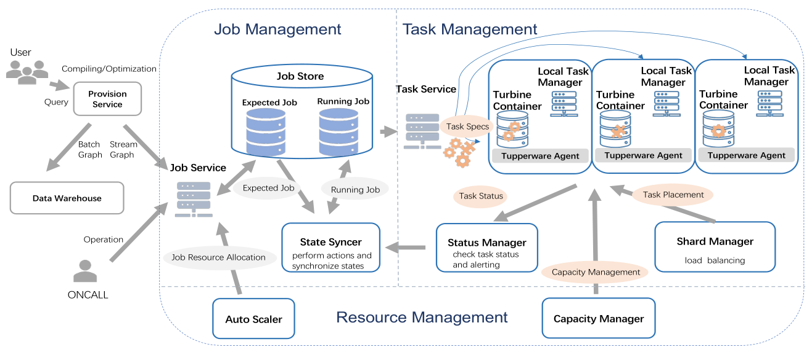
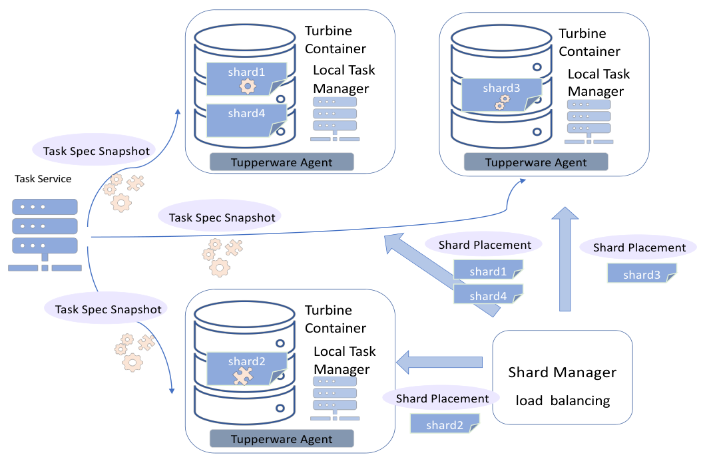
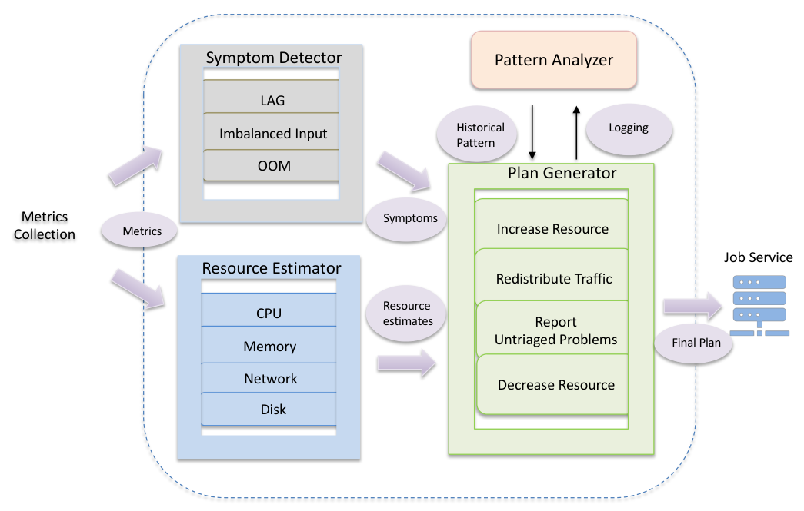

---
lang: es-AR
title: 'Turbine: Facebook’s Service Management Platform for Stream Processing'
author:
- Yuan Mei
- Luwei Cheng
- Vanish Talwar
- Michael Y. Levin
- Gabriela Jacques-Silva
- Nikhil Simha
- Anirban Banerjee
- Brian Smith
- Tim Williamson
- Serhat Yilmaz
- Weitao Chen
- Guoqiang Jerry Chen
date: Juan Ignacio Díaz, Francisco Pereira # hack horrible para que se vea bien en la presentación
theme:
- Copenhagen
...

# Turbine

- Fast and scalable task scheduler.
- Efficient predictive auto scaler.
- ACID, fault-tolerant (ACIDF) application update mechanism.
- Service management platform on top of cluster management systems [^1].
- Currently integrates with Tupperware[@narayanan2014tupperware], a low level
  host manager.

[^1]: Aurora, Mesos, Borg, Tupperware, Kubernetes, etc.

# System Overview

- Job Management layer: What to run?
- Task Management layer: Where to run?
- Resource Management layer: How to run?

[@mei2020turbine]

# Job Management

- Job Service
- State Syncer
- Job Store

+---------------------------+
| Expected Job Table        |
+:=========================:+
| Base Configuration        |
+---------------------------+
| Provisioner Configuration |
+---------------------------+
| Scaler Configuration      |
+---------------------------+
| Oncall Configuration      |
+---------------------------+

: **Job Store Schema.** [@mei2020turbine]

# Task Management

[@mei2020turbine]

# Resource Management

[@mei2020turbine]

# Resource Management

## Capacity Management:

- Monitor resource usage of jobs in a cluster
- Manage resource allocations
- Disaster recovery

# Bibliografía
